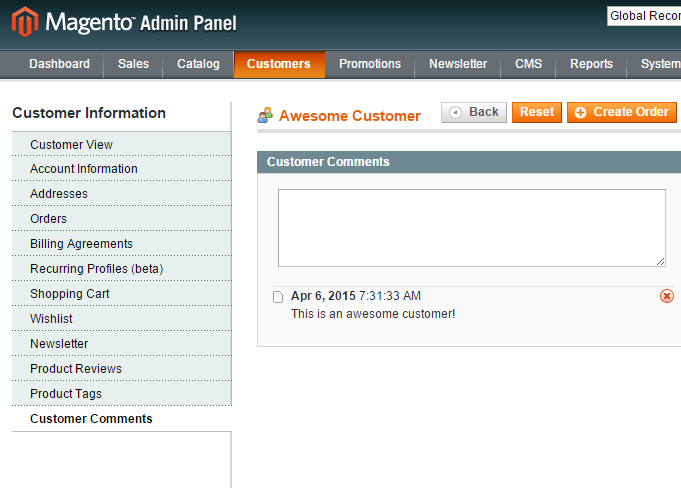

# Customer Comments
Customer Comments extension allows admins to add comments to customers. Customer's comments history will also be visibile on every order by this customer. Customer comments can be added and viewed in Magento Admin only.

# Key Features
- Add comments to customers on customer edit page
- Delete customer comments
- View history of comments both on customer page and order page

# Compatibility

Magento 1.7, 1.8, 1.9

# Installation Instructions

Upload all files to your Magento root directory.
Clear the cache.
